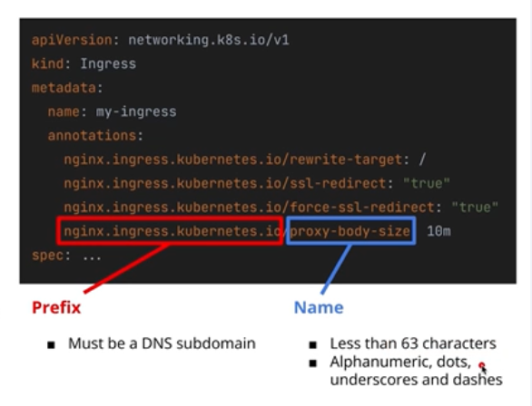
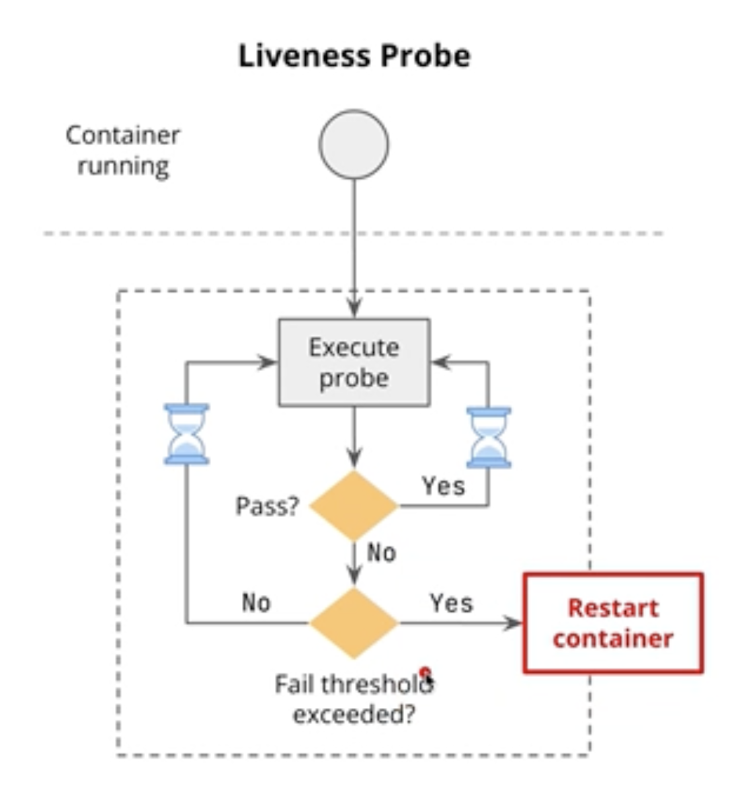
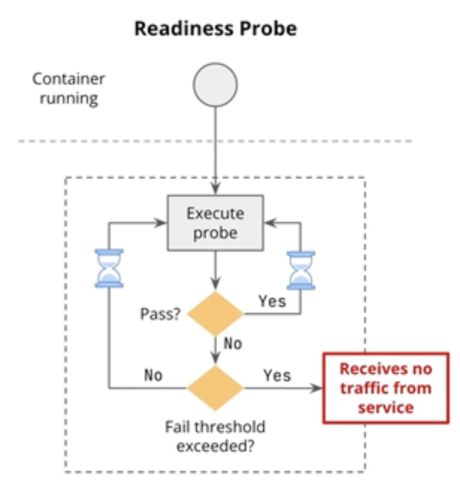
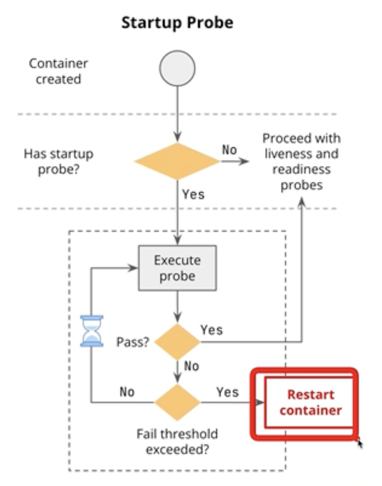

# :shield:  Advanced Kubernetes - Security & Large Scale Deployments

## Table of Contents
- [:shield:  Advanced Kubernetes - Security \& Large Scale Deployments](#shield--advanced-kubernetes---security--large-scale-deployments)
  - [Table of Contents](#table-of-contents)
  - [Managing K8s Resources](#managing-k8s-resources)
    - [Labels](#labels)
    - [Selectors](#selectors)
    - [Annotations](#annotations)
    - [Namespaces](#namespaces)
      - [Liveliness, Readiness and Startup Probes](#liveliness-readiness-and-startup-probes)
  - [Security, RBAC and Network Policies](#security-rbac-and-network-policies)
    - [Kubernetes Security Overview](#kubernetes-security-overview)
    - [Security Issues \& Certificates](#security-issues--certificates)
  - [Kubernetes](#kubernetes)
  - [File Structure](#file-structure)
  - [Troubleshooting](#troubleshooting)
  - [References](#references)

---
 
## Managing K8s Resources
*Labels & Selectors*: used to identify and group resources meaningfully.

### Labels
  - key-value pairs attached to kubernetes objects (i.e., pods, nodes, service, replicasets, deployments). They provide metadata that helps identify and organize these objects.

### Selectors
- expressions used to filter k8s objects based on their labels. Selectors allow users and k8s components to target specific objects that match certain criteria.

Example:

**Labels**

| Pod 1 | Pod 2 | Pod 3|
|----------|----------|---------|
| labels:<br> &nbsp;&nbsp; app: color-api <br>  &nbsp;&nbsp;environment: dev <br> &nbsp;&nbsp; tier: frontend <br> &nbsp;&nbsp; release: stabe <br>  | labels:<br> &nbsp;&nbsp; app: color-api <br> &nbsp;&nbsp; environment: dev <br> &nbsp;&nbsp; tier: backend <br> &nbsp;&nbsp; release: sit <br>   | labels:<br>  &nbsp;&nbsp; app: ecomm <br> &nbsp;&nbsp; environment: prod <br> &nbsp;&nbsp; tier: backend <br> &nbsp;&nbsp; release: stable <br>   |

**Q1:** What pod/s are returned if the selector (equality-based & used either =, ==, or != ) is:
```
selector:
  matchlabels:
    app: color-api
    tier: backend
```
**A1: The Pod 2**

**Q2:** What pods are returned if the selector (set-based selector which uses operators like In, NotIn, Exists, DoesNotExist) is:
```
selector:
  matchExpressions:
    - key: environment
      operator: NotIn
      values: [dev]
```
**A2: The Pod 3**

Apply and deploy the pods created at *~/color-api.yaml*
>k apply -f color-api.yaml

Use the label tier to only filter pods 'backend' during display
>k get pods -l tier=backend

**Multiple Queries**
Filter  tier and app where tier is frontend and app is named color-api
>k get pods -l 'tier=frontend,app=color-api'

Filter the tier to only display pods in the list
>k get pods -l 'tier in (frontend)'

Delete all resources created.
>k delete -f color-api.yaml

Also, makes use of the property 'matchExpressions' when defining your deployment spec so that it will be only doing things under 'managed'
```
spec:
  replicas: 3
  selector:
    matchLabels:
      app: color-api
      environment: local
      tier: backend
    matchExpressions:
      - key: managed
        operator: Exists
  template:
    metadata:
      labels:     
        app: color-api
        environment: local
        tier: backend
        managed: 'deployment'
```
### Annotations
 - key value pairs attached to kubernetes objects (in metadata same as label)
 - unlike labels, they are not supposed to store identifying metadata, and they are often used by tooks/kubernetes system itself to configure certain services or other activities.
 - Common use cases:
    - **Tool-specifc metadata & config**: external tools (monitoring systems, logging agents) leverage them to attach custom data to resources (configuraitons, metrics collection endpoints, etc)
    - **Configuration for ingress controllers**: used to configure ingress controllers (traffic routing, SSL termination, security settings)
    - **Storing build and version information**: annotations can store metadata such as build timestamps, version numbers, or git commit hashes
    - **Runtime configuration for operatprs**: kubernetes operations or controllers can use annotations to customize runtime behavior for specific resources
     


### Namespaces
  - improve isolation for groups of resources
  - grouping can be based on environment (dev, prod)
  - it provide a way to divide cluster resources between multiple users, teams, applications, or environments.
  - allows for resource isolation and helps organize workloads in large kubernetes clusters

Common use-cases:
1. Multi-tenant cluster: each team can take care of their apps & keep their resources (pods, services, etc) logically separated
2. evnronment separation: each environment can have its own resources, w/ different policies and quotas
3. Resource quotas: we wish to limit the CPU usage, memory and number of resources that a namespace can use. It prevents one team or environment from monipolizing the cluster resources
4. Security and access control: we wish to limit user or service account access to specific resources via RBAC mechanisms. This ensures that users or services can only access resources within their allowed namespaces

Addtional notes:
- Using namespaces:
  - must inform in which namespace we wish to create our resources
  - we can set a current namespace for all kubectl commands, or pass it explicitly in each command
  - service comms requires the fully qualified doman name (FQDN) of the service

⚒️ To change the default namespace to your customized/desired namespace, do these steps:
1. Check the current context
> k config current-context

2. Update the current context's namespace
> k config set-context --current --namespace=dev

Then all your commands is directly projected to the dev namespace and not the default.

List all the pods in your cluster across all namespaces:
>k get pods --all-namespaces,
>k get pods -A

⚠️ Be very careful deleting namespaces since it also automatically deletes also all resources under it. Best practise is to add RBAC control to only allow a few to be able to perform delete namespace since this is a destructive operation.
>k delete -f dev-ns.yaml

Create a resource quota to limit the number of resources that can be created in a namespace. Create a file named *dev-quota.yaml* and add the ff. content:
```
apiVersion: v1
kind: ResourceQuota
metadata:
  name: dev-quota
  namespace: dev
spec:
    hard:
        pods: "10"
        requests.cpu: "4"
        requests.memory: 8Gi
        limits.cpu: "8"
        limits.memory: 16Gi
```
Apply the resource quota
>k apply -f dev-quota.yaml

Check the resource quota
>k get resourcequota -n dev
>k describe resourcequota dev-quota

OR check every resource quotas for all namespaces
>k get resourcequota -A


#### Liveliness, Readiness and Startup Probes
- Probes are used to check the health and status of containers in a pod.
- They help ensure that containers are running correctly and can handle requests.
- There are three types of probes:
  1. **Liveliness Probe**: checks if the container is running. If it fails, the container is restarted.
    
  2. **Readiness Probe**: checks if the container is ready to handle requests. If it fails, the container is removed from service endpoints.
    
  3. **Startup Probe**: checks if the container has started successfully. It is used for containers that take a long time to start.
    

Tips:
To avoid recreating pods and deleting them, we can easily just scale the deployment.
To scale down
>k scale deployment color-api --replicas=0

To scale up
>k scale deployment color-api --replicas=6

And to lookup the healthy pods that were successfully deployed, you can refer to the service. Look for endpoints (IP addresses)
>k describe service color-api-svc

Verify healthy endpoints by comparing it to the pods
>k get pods -o wide

---
## Security, RBAC and Network Policies
they are cryptographic keys that:

**Q: What are certificates?**

**A:** Certificates are cryptographic keys that:
  - Ensure secure communication
  - Authenticate with encryption

To interact with you kubernetes cluster securely, you must include the ff. in your Context creation:
  - Cluster's API server URL
  - Paths to appropriate certificate files
  - Client certificate and key

And then you can setup your kubectl configuration to use this context.

### Kubernetes Security Overview
Kubernetes security encompasses:

**1. Authentication**
  - Certificates, tokens, OpenID Connect
  - Verify identity
  
**2. Authorization**
  - Define permissible actions
  - RBAC

**3. Network Policies**
  - Control communication
  - Enhance security

**4. Secrets**
  - Store and manage sensitive information
  - API tokens/ passwords

### Security Issues & Certificates
|  |  |  |  |
|----------|----------|----------|----------|
| ISSUES   | Certificate expiry   | Unauthorized access  | Man-in-the-Middle Attacks   |
| MITIGATIONS   | Require regular renewal or rotation   | Certificate management   | Use strong, trusted certificates   |

## Kubernetes 
**yyy**
  - Certificates
---

## File Structure
---

## Troubleshooting
---

## References
---
